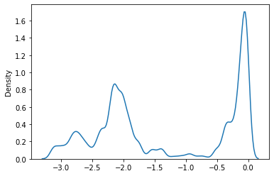
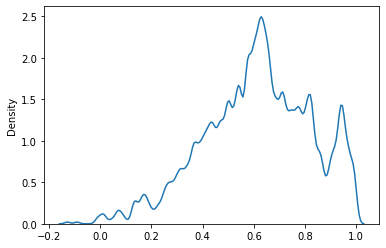
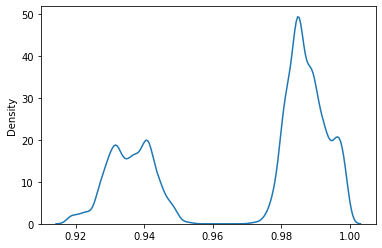
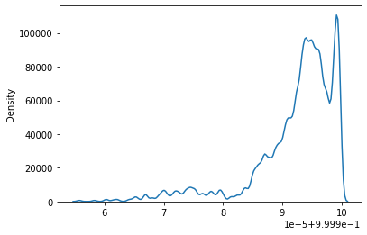
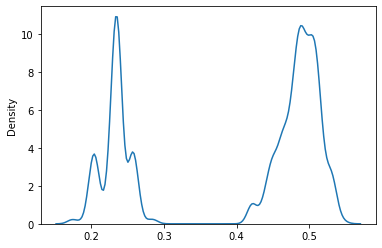
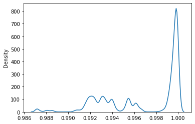
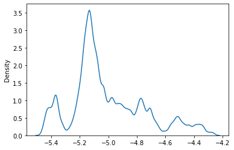

<!-- Improved compatibility of back to top link: See: https://github.com/dmighty007/SolOrder/pull/73 -->
<a name="readme-top"></a>
<!--
*** Thanks for checking out the SolOrder. If you have a suggestion
*** that would make this better, please fork the repo and create a pull request
*** or simply open an issue with the tag "enhancement".
*** Don't forget to give the project a star!
*** Thanks again! Now go create something AMAZING! :D
-->


<!-- PROJECT SHIELDS -->
<!--
*** I'm using markdown "reference style" links for readability.
*** Reference links are enclosed in brackets [ ] instead of parentheses ( ).
*** See the bottom of this document for the declaration of the reference variables
*** for contributors-url, forks-url, etc. This is an optional, concise syntax you may use.
*** https://www.markdownguide.org/basic-syntax/#reference-style-links
-->
[![Contributors][contributors-shield]][contributors-url]
[![Forks][forks-shield]][forks-url]
[![Stargazers][stars-shield]][stars-url]
[![Issues][issues-shield]][issues-url]
[![MIT License][license-shield]][license-url]
[![LinkedIn][linkedin-shield]][linkedin-url]


<!-- PROJECT LOGO -->
<br />
<div align="center">
  <a href="https://github.com/dmighty007/SolOrder">
    
  </a>

  <h3 align="center">SolOrder</h3>

  <p align="center">
    A module to calculate various structural order parameter related to water molecules. This project initiated with the aim to 
    distinguish between different polymorphs of ice.
    <br />
    <a href="https://github.com/dmighty007/SolOrder"><strong>Explore the docs »</strong></a>
    <br />
    <br />
    <a href="https://github.com/dmighty007/SolOrder">View Demo</a>
    ·
    <a href="https://github.com/dmighty007/SolOrder/issues">Report Bug</a>
    ·
    <a href="https://github.com/dmighty007/SolOrder/issues">Request Feature</a>
  </p>
</div>


<!-- TABLE OF CONTENTS -->
<details>
  <summary>Table of Contents</summary>
  <ol>
    <li>
      <a href="#about-the-project">About The Project</a>
    </li>
    <li>
      <a href="#getting-started">Getting Started</a>
      <ul>
        <li><a href="#prerequisites">Prerequisites</a></li>
        <li><a href="#installation">Installation</a></li>
      </ul>
    </li>
    <li><a href="#usage">Usage</a></li>
    <li><a href="#contributing">Contributing</a></li>
    <li><a href="#license">License</a></li>
    <li><a href="#contact">Contact</a></li>
    <li><a href="#acknowledgments">Acknowledgments</a></li>
  </ol>
</details>


<!-- ABOUT THE PROJECT -->
## About The Project

[![Product Name Screen Shot][product-screenshot]](https://example.com)

*SolOrder* is purposed to calculate simple structural property based order parameter of water molecules in MD simulation output. This module is validated for gromacs output files.   
Currently it can calculate *Four body structural order parameter($F_4$)*, *Orientational and translational tetrahedral order parameter(OTO & TTO)*, *Local structure index(LSI)*, *Local entropy fingerprints* etc by follwing the protocols specified in the literature so far. There are a lot more order parameters related to water structure and we wish to have them under one roof. Our current interest should be including bond orientational order parameters and SOAP(Smooth Overlap of Atomic Positions) related order paramter to the *SolOrder* module. There's a lot we can actually do to incrase number of ways to accurately detect phases, of which immediates are invoking ideas of molecular graph and ML. 

<p align="right">(<a href="#readme-top">back to top</a>)</p>


<!-- GETTING STARTED -->
## Getting Started


### Prerequisites

This module uses few optimized modules such as MDAnalysis, pandas, numba, numpy etc. to fast-track the calculation of OPs. They are listed in `requirements.txt` file. You can install them using either pip or conda. Like below...
* MDAnalysis
  ```sh
  pip install MDAnalysis
  ```

### Installation

_You may not need to install the module. Just clone the repository and import them locally. To install the **SolOrder** module globally you can 
do either of the following ways ._

1. Clone the repo
   ```sh
   git clone https://github.com/dmighty007/SolOrder.git
   cd SolOrder
   python setup.py install
   ```
2. Or you can install directly from pypi store..
   ```sh
   pip install SolOrder
   ```


<p align="right">(<a href="#readme-top">back to top</a>)</p>


<!-- USAGE EXAMPLES -->
## Usage

_For more examples, please refer to the [Documentation](https://example.com)_
```python
######## Import two classes from the module...
from SolOrder import OrderParameter as OP
from SolOrder import eFingerprint as E
```

```python
########## Basic modules....
import numpy as np
import MDAnalysis as mda
import seaborn as sns
import matplotlib.pyplot as plt
```


```python
########## The MDAnalysis universe object...
u = mda.Universe("sH.gro")
u
```


    <Universe with 7344 atoms>


## Dihedral angle distribution and other order parameters


```python
######## Create the object..
obj = OP(u)
```


```python
########## Dihedral angle distribution...
obj.get_dihedrals()
sns.kdeplot(obj.dihedrals, bw_method = 0.05)
```
    

    


F4 order parameter is a mathematical function of the total number of water molecules and the torsion angle between the O-H bond of two water molecules, such that oxygen atoms of both water molecules have a distance that is less than 0.3 nm. This particular parameter can discriminate between bulk liquid water, ice, and sI crystal. It has a value of -0.4, -0.04, and 0.7 for bulk liquid water, regular ice, and sI hydrate crystals respectively.It is given as..

$$F_4 = \frac{1}{N}\sum(cos3\phi)$$


```python
obj.F4()
sns.kdeplot(obj.f4, bw_method = 0.05)
```

    

    


The below is the most common type of tetrahedral order paramater that is being used. This order parameter uses the four closest water Oxygen neighbors for the calculation. The value of q can rang from 0 to 1, where 0 is for an ideal gas and 1 is for a regular tetrahedron.
$$q = 1− \frac{3}{8}\sum_{j=1}^3\sum_{k=j+1}^4(cos\phi_{jk}+\frac{1}{3})^2$$

$q =$ Orientational tetrahedral order parameter.\
$\phi_{jk}=$ Angle formed by the Oxygen atom under consideration & the two nearest neighbor atoms j & k.

```python
obj.OTO()
sns.kdeplot(obj.tetra_orient,bw_method = 0.05)
```

    

    


Similar to orientational tetrahedral order. But here, the variance of the radial distance between the central water oxygen atom and the four nearest neighbors are calculated. THe value of $S_k$ is close to 1 and equals to 1 for the perfect tetrahedron. As the local tetrahedral nature increases, $S_k$ becomes more closer to 1.

$$ S_k = 1−\frac{1}{3}\sum_{k=1}^4\frac{(r_k−\bar{r})^2}{4\bar{r}^2}$$

$S_k$ = Translational tetrahedral order parameter

$r_k$ = Radial distance from the cental Oxygen atom to the k th peripheral closest neighbor

$\bar{r}$ = Arithmatic mean of the four radial distances


```python
obj.TTO()
sns.kdeplot(obj.tetra_trans,bw_method = 0.05)
```

    

    


The local-structure-index (LSI) is defined for each molecule i by ordering the
nearest neighbors j according to increasing distance to reference molecule i as 

$r_1 < r_2 < r_3 < ... < r_{n(i)} < 0.37 nm < r_{n(i)+1}$ 


where $n(i)$ is the number of molecules that are within $0.37 nm $ from molecule i (oxygen atom positions are used). The LSI distinguishes molecules with well separated first
and second coordination shells from molecules with disordered environment, containing
molecules in interstitial positions, through the parameter $I(i)$ defined by  

$$ I(i) = \frac{1}{n(i)} \sum_{j=1}^{n(i)}[\Delta(j;i) - \bar{\Delta}(i)]^2 $$

Here $\Delta(j;i) = r_{j+1}- r_j$ and $\bar{\Delta}(i)$ is the average of $\Delta(j;i)$ over all neighbors j of molecule i within the cutoff. A low LSI corresponds to a disordered local environment (HDL) while a
high LSI indicates a highly structured, tetrahedral coordination (LDL).


```python
obj.LSI()
sns.kdeplot(obj.lsi,bw_method = 0.05)
```
    

    

```python
obj.MinimumAngle()
sns.kdeplot(np.cos(obj.minAngles),bw_method = 0.05)
```
    

    


## Entropy Fingerprints

Entropy is a global property, hence, to define alocal order parameter, it is projected onto each particle i as :

$$ e(i) = -2 \pi \rho  k_b  \int_0^{r_m} [{g_m^i(r)}\ln(g_m^i(r)) - g_m^i(r) + 1 ] r^2 dr $$

where $g_m^i(r)$ is the radial distribution function centred on particle i, which can be smoothed with Gaussians of finite width (here we choose 0.15 $\unicode{x212B}$) for obtaining a continuous and differentiable order parameter.In eqn $r_m$ represents an upper integration limit which, in a rigorous definition of entropy, should approach infinity; here $r_m$ is set to 5.0 $\unicode{x212B}$.\\
The modifier function stores the computed pair entropy values, which are always negative, in the output particle property Entropy. Lower entropy values correspond to more ordered structural environments. The modifier function does not take into account the types of the input particles; it assumes the model is a single-component system.
To improve the resolution between different environments,a locally averaged entropy, le, can be defined as:


$$ le(i) = \frac{1}{(N+1)} \sum_{i=1}^N e(i) $$


```python
entropy = E(u)
```


```python
entropy.Entropy()
```


      0%|          | 0/1836 [00:00<?, ?it/s]


```python
entropy.localEntropy()
```


      0%|          | 0/1836 [00:00<?, ?it/s]


```python
sns.kdeplot(entropy.le, bw_method = 0.05)
```

    


<p align="right">(<a href="#readme-top">back to top</a>)</p>


<!-- CONTRIBUTING -->
## Contributing

Contributions are what make the open source community such an amazing place to learn, inspire, and create. Any contributions you make are **greatly appreciated**.

If you have a suggestion that would make this better, please fork the repo and create a pull request. You can also simply open an issue with the tag "enhancement".
Don't forget to give the project a star! Thanks again!

1. Fork the Project
2. Create your Feature Branch (`git checkout -b feature/AmazingFeature`)
3. Commit your Changes (`git commit -m 'Add some AmazingFeature'`)
4. Push to the Branch (`git push origin feature/AmazingFeature`)
5. Open a Pull Request

<p align="right">(<a href="#readme-top">back to top</a>)</p>


<!-- LICENSE -->
## License

Distributed under the MIT License. See `LICENSE` for more information.

<p align="right">(<a href="#readme-top">back to top</a>)</p>


<!-- CONTACT -->
## Contact

Dibyendu Maity - [@MAITYDIBYENDU99](https://twitter.com/@MAITYDIBYENDU99) - dibyendumaity1999@bose.res.in

Project Link: [https://github.com/dmighty007/SolOrder](https://github.com/dmighty007/SolOrder)

<p align="right">(<a href="#readme-top">back to top</a>)</p>


<!-- ACKNOWLEDGMENTS -->
## Acknowledgments

Below are the references, basically from where the ideas and algorithms are taken. We might want to benchmark with their results!!
* [Investigating the quasi-liquid layer on ice surfaces: a comparison of order parameters](https://pubs.rsc.org/en/content/articlelanding/2022/CP/D2CP00752E)
* [Mining of Effective Local Order Parameters to Classify Ice Polymorphs](https://doi.org/10.1021/acs.jpca.1c06685)
* [Characterization of the Local Structure in Liquid Water by Various Order Parameters](https://doi.org/10.1021/acs.jpcb.5b02936)

<p align="right">(<a href="#readme-top">back to top</a>)</p>


<!-- MARKDOWN LINKS & IMAGES -->
<!-- https://www.markdownguide.org/basic-syntax/#reference-style-links -->
[contributors-shield]: https://img.shields.io/github/contributors/dmighty007/SolOrder.svg?style=for-the-badge
[contributors-url]: https://github.com/dmighty007/SolOrder/graphs/contributors
[forks-shield]: https://img.shields.io/github/forks/dmighty007/SolOrder.svg?style=for-the-badge
[forks-url]: https://github.com/dmighty007/SolOrder/network/members
[stars-shield]: https://img.shields.io/github/stars/dmighty007/SolOrder.svg?style=for-the-badge
[stars-url]: https://github.com/dmighty007/SolOrder/stargazers
[issues-shield]: https://img.shields.io/github/issues/dmighty007/SolOrder.svg?style=for-the-badge
[issues-url]: https://github.com/dmighty007/SolOrder/issues
[license-shield]: https://img.shields.io/github/license/dmighty007/SolOrder.svg?style=for-the-badge
[license-url]: https://github.com/dmighty007/SolOrder/blob/master/LICENSE.txt
[linkedin-shield]: https://img.shields.io/badge/-LinkedIn-black.svg?style=for-the-badge&logo=linkedin&colorB=555
[linkedin-url]: https://linkedin.com/in/dmighty007
[product-screenshot]: images/screenshot.png
[Next.js]: https://img.shields.io/badge/next.js-000000?style=for-the-badge&logo=nextdotjs&logoColor=white
[Next-url]: https://nextjs.org/
[React.js]: https://img.shields.io/badge/React-20232A?style=for-the-badge&logo=react&logoColor=61DAFB
[React-url]: https://reactjs.org/
[Vue.js]: https://img.shields.io/badge/Vue.js-35495E?style=for-the-badge&logo=vuedotjs&logoColor=4FC08D
[Vue-url]: https://vuejs.org/
[Angular.io]: https://img.shields.io/badge/Angular-DD0031?style=for-the-badge&logo=angular&logoColor=white
[Angular-url]: https://angular.io/
[Svelte.dev]: https://img.shields.io/badge/Svelte-4A4A55?style=for-the-badge&logo=svelte&logoColor=FF3E00
[Svelte-url]: https://svelte.dev/
[Laravel.com]: https://img.shields.io/badge/Laravel-FF2D20?style=for-the-badge&logo=laravel&logoColor=white
[Laravel-url]: https://laravel.com
[Bootstrap.com]: https://img.shields.io/badge/Bootstrap-563D7C?style=for-the-badge&logo=bootstrap&logoColor=white
[Bootstrap-url]: https://getbootstrap.com
[JQuery.com]: https://img.shields.io/badge/jQuery-0769AD?style=for-the-badge&logo=jquery&logoColor=white
[JQuery-url]: https://jquery.com 
