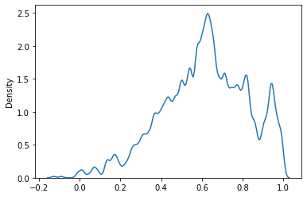
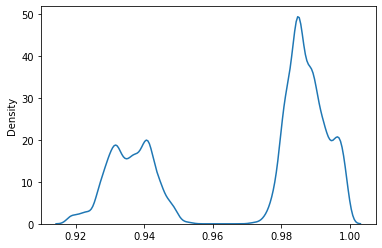
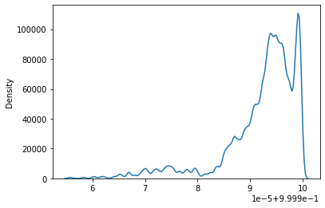
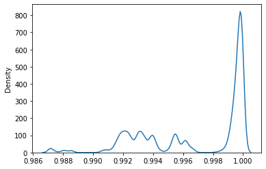

```python
######## Import two classes from the module...
from SolOrder import OrderParameter as OP
from SolOrder import eFingerprint as E
```

    <frozen importlib._bootstrap>:228: RuntimeWarning: scipy._lib.messagestream.MessageStream size changed, may indicate binary incompatibility. Expected 56 from C header, got 64 from PyObject


```python
########## Basic modules....
import numpy as np
import MDAnalysis as mda
import seaborn as sns
import matplotlib.pyplot as plt
```


```python
########## The MDAnalysis universe object...
u = mda.Universe("sH.gro")
u
```


    <Universe with 7344 atoms>


## Dihedral angle distribution and other order parameters


```python
######## Create the object..
obj = OP(u)
```


```python
########## Dihedral angle distribution...
obj.get_dihedrals()
sns.kdeplot(obj.dihedrals, bw_method = 0.05)
```


      0%|          | 0/1836 [00:00<?, ?it/s]


    /home/dibya/Documents/GitHub/SolOrder/SolOrder/dihedral.py:132: RuntimeWarning: invalid value encountered in arccos
      return -_np.arccos(_np.dot(abc,bcd)/(_np.linalg.norm(abc)*_np.linalg.norm(bcd)))


    <AxesSubplot:ylabel='Density'>


    

    


F4 order parameter is a mathematical function of the total number of water molecules and the torsion angle between the O-H bond of two water molecules, such that oxygen atoms of both water molecules have a distance that is less than 0.3 nm. This particular parameter can discriminate between bulk liquid water, ice, and sI crystal. It has a value of -0.4, -0.04, and 0.7 for bulk liquid water, regular ice, and sI hydrate crystals respectively.It is given as..

$$F_4 = \frac{1}{N}\sum(cos3\phi)$$


```python
obj.F4()
sns.kdeplot(obj.f4, bw_method = 0.05)
```


      0%|          | 0/1836 [00:00<?, ?it/s]


    /home/dibya/Documents/GitHub/SolOrder/SolOrder/dihedral.py:132: RuntimeWarning: invalid value encountered in arccos
      return -_np.arccos(_np.dot(abc,bcd)/(_np.linalg.norm(abc)*_np.linalg.norm(bcd)))


    <AxesSubplot:ylabel='Density'>


    

    


The below is the most common type of tetrahedral order paramater that is being used. This order parameter uses the four closest water Oxygen neighbors for the calculation. The value of q can rang from 0 to 1, where 0 is for an ideal gas and 1 is for a regular tetrahedron.
$$q = 1− \frac{3}{8}\sum_{j=1}^3\sum_{k=j+1}^4(cos\phi_{jk}+\frac{1}{3})^2$$

$q = $ Orientational tetrahedral order parameter

$\phi_{jk}= $ Angle formed by the Oxygen atom under consideration & the two nearest neighbor atoms j & k


```python
obj.OTO()
sns.kdeplot(obj.tetra_orient,bw_method = 0.05)
```


      0%|          | 0/1836 [00:00<?, ?it/s]


    <AxesSubplot:ylabel='Density'>


    

    


Similar to orientational tetrahedral order. But here, the variance of the radial distance between the central water oxygen atom and the four nearest neighbors are calculated. THe value of $S_k$ is close to 1 and equals to 1 for the perfect tetrahedron. As the local tetrahedral nature increases, $S_k$ becomes more closer to 1.

$$ S_k = 1−\frac{1}{3}\sum_{k=1}^4\frac{(r_k−\bar{r})^2}{4\bar{r}^2}$$

$S_k$ = Translational tetrahedral order parameter

$r_k$ = Radial distance from the cental Oxygen atom to the k th peripheral closest neighbor

$\bar{r}$ = Arithmatic mean of the four radial distances


```python
obj.TTO()
sns.kdeplot(obj.tetra_trans,bw_method = 0.05)
```


      0%|          | 0/1836 [00:00<?, ?it/s]


    <AxesSubplot:ylabel='Density'>


    

    


he local-structure-index (LSI) 18,19 is defined for each molecule i by ordering the
nearest neighbors j according to increasing distance to reference molecule i as $r_1 < r_2 < r_3 < ...
< r_{n(i)} < 0.37 nm < r_{n(i)+1}$ where $n(i)$ is the number of molecules that are within $0.37 nm $ from molecule i (oxygen atom positions are used). The LSI distinguishes molecules with well separated first
and second coordination shells from molecules with disordered environment, containing
molecules in interstitial positions, through the parameter $I(i)$ defined by
$$ I(i) = \frac{1}{n(i)} \sum_{j=1}^{n(i)}[\Delta(j;i) - \bar{\Delta}(i)]^2 $$
Here $\Delta(j;i) = r_{j+1}- r_j$ and $\bar{\Delta}(i)$ is the average of $\Delta(j;i)$ over all neighbors j of molecule i within the cutoff. A low LSI corresponds to a disordered local environment (HDL) while a
high LSI indicates a highly structured, tetrahedral coordination (LDL).


```python
obj.LSI()
sns.kdeplot(obj.lsi,bw_method = 0.05)
```


      0%|          | 0/1836 [00:00<?, ?it/s]


    <AxesSubplot:ylabel='Density'>


    

    


```python
obj.MinimumAngle()
sns.kdeplot(np.cos(obj.minAngles),bw_method = 0.05)
```


      0%|          | 0/1836 [00:00<?, ?it/s]


    <AxesSubplot:ylabel='Density'>


    

    


## Entropy Fingerprints

Entropy is a global property, hence, to define alocal order parameter, it is projected onto each particle i as :
$$ e(i) = -2 \pi \rho  k_b  \int_0^{r_m} [{g_m^i(r)}\ln(g_m^i(r)) - g_m^i(r) + 1 ] r^2 dr $$
where $g_m^i(r)$ is the radial distribution function centred on particle i, which can be smoothed with Gaussians of finite width (here we choose 0.15 $\unicode{x212B}$) for obtaining a continuous and differentiable order parameter.In eqn $r_m$ represents an upper integration limit which, in a rigorous definition of entropy, should approach infinity; here $r_m$ is set to 5.0 $\unicode{x212B}$.\\
he modifier function stores the computed pair entropy values, which are always negative, in the output particle property Entropy. Lower entropy values correspond to more ordered structural environments. The modifier function does not take into account the types of the input particles; it assumes the model is a single-component system.
To improve the resolution between different environments,a locally averaged entropy, le, can be defined as:
$$ le(i) = \frac{1}{(N+1)} \sum_{i=1}^N e(i) $$


```python
entropy = E(u)
```


```python
entropy.Entropy()
```


      0%|          | 0/1836 [00:00<?, ?it/s]


```python
entropy.localEntropy()
```


      0%|          | 0/1836 [00:00<?, ?it/s]


```python
sns.kdeplot(entropy.le, bw_method = 0.05)
```


    <AxesSubplot:ylabel='Density'>


    

    

